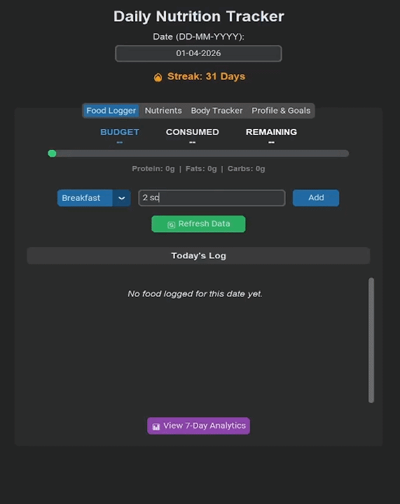
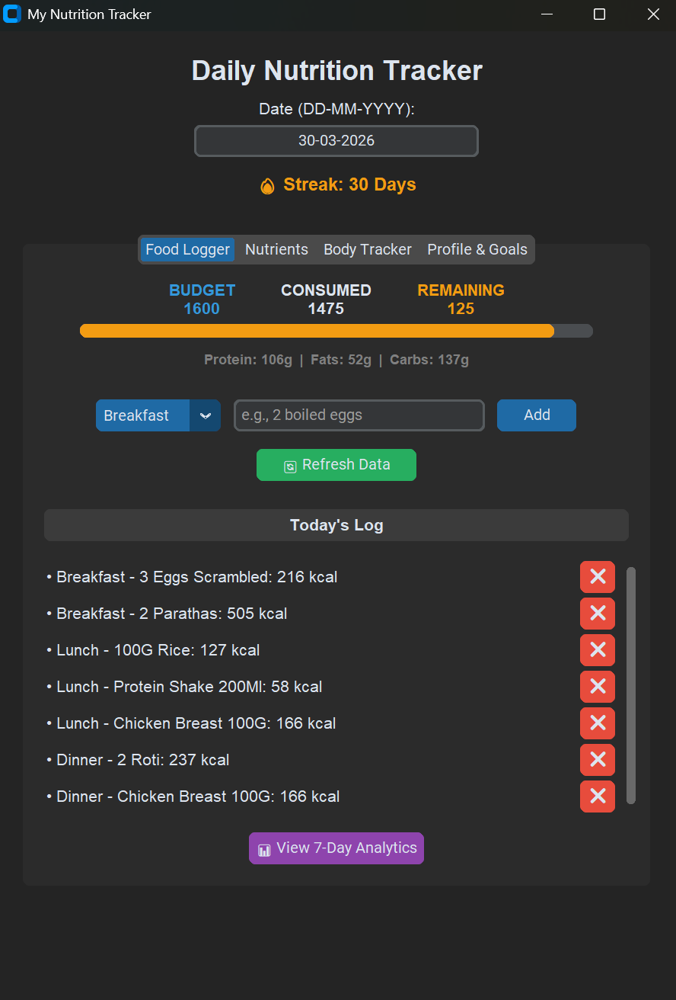
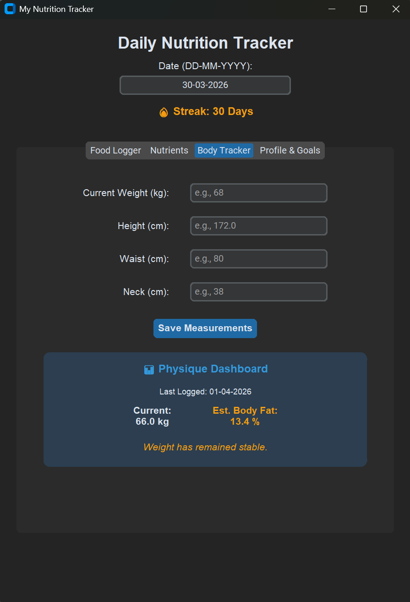
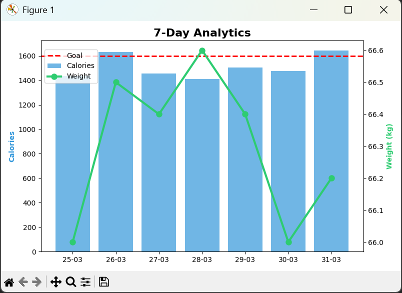

# 🍏 Daily Nutrition & Physique Tracker


A privacy-focused desktop nutrition tracking application with API-powered food analysis, body-fat estimation, and real-time analytics without relying on external databases or cloud infrastructure. This platform combines a modern graphical user interface with REST API integration, local data caching, and mathematical formulas to monitor macronutrients, micronutrients, and body composition.

Most calorie tracking apps either require paid subscriptions or store user data in cloud services. This project explores a simple, locally-hosted desktop alternative that keeps all user data stored locally on your machine while still leveraging external APIs for nutritional information.

Built as part of a personal 90-day fitness and programming challenge to reach 12% body fat while improving Python software development skills.

---

## 🎥 Demo



---

## ⚠️ Architecture & Data Persistence

This application was built with a focus on rapid iteration and local privacy. To avoid setting up an external database, the app uses Python's pathlib to create a dedicated application data folder (~/NutritionTrackerData) on the user's machine. All state and history are managed through local JSON files, ensuring your data persists between sessions without the overhead of a database server.

---

## 🚀 Features

- **API Food Logger:** Integrates with the CalorieNinjas REST API to instantly fetch comprehensive macro and micronutrient data via natural language queries (e.g., "2 boiled eggs").
- **Local Data Caching:** Checks a local custom_foods.json file to calculate exact macros for niche supplements or regional meals. Optimized to minimize API calls through local caching, reducing redundant network requests and improving app responsiveness.
- **Advanced Physique Tracking:** Implements the established U.S. Navy Body Fat formula to calculate real-time body fat percentages using daily waist, neck, and height inputs.
- **Automated Target Calculation:** Uses established Basal Metabolic Rate (BMR) and Total Daily Energy Expenditure (TDEE) formulas to automatically suggest precise caloric deficits for cutting phases.
- **Dynamic Data Visualization:** Utilizes Matplotlib to generate a dual-axis, 7-day graphical trend analysis comparing total calorie consumption against body weight fluctuations.
- **Persistent State Management:** Features robust JSON document storage for seamless session persistence, daily streak tracking, and secure environment variable handling via `python-dotenv`.

---

## 🌍 Impact

- Eliminates reliance on subscription-based fitness apps by providing a fully local alternative.
- Reduces API dependency through intelligent caching of frequently logged foods.
- Demonstrates how privacy-first desktop applications can replicate core features of modern cloud-based apps.

---
## 🧠 Key Engineering Challenges Solved

- Designing a caching system to avoid unnecessary API calls
- Creating OS-independent data storage using pathlib
- Embedding matplotlib charts inside a CustomTkinter GUI
- Maintaining persistent application state without a database

---
## ⚖️ Design Decisions & Trade-offs

- **JSON over SQLite:** Chose flat JSON files over a relational database for simplicity and portability in a desktop-first, single-user environment.
- **Synchronous API calls:** Used standard requests instead of asynchronous libraries to reduce complexity, as the app only makes single, lightweight queries triggered by user input.
- **Monolithic Architecture:** Initially developed as a single-file prototype (main.py) to prioritize rapid iteration. The code is logically structured to enable a smooth transition toward a modular MVC architecture in future iterations.

---

## 🎯 Skills Demonstrated

* RESTful API integration and JSON data handling
* Desktop Graphical User Interface (GUI) architecture
* Applied mathematical algorithms (Body Fat %, BMR/TDEE)
* Local state management and file I/O operations
* Data visualization and charting (`Matplotlib`)
* First-run application logic and executable distribution

---

## 🛠 Tech Stack

**Frontend (GUI)**
- `CustomTkinter` (Modern, dark-mode native Python UI framework)
- `Matplotlib` (Embedded charting and analytics)

**Backend & Logic**
- Python 3.14
- `requests` (Synchronous HTTP requests)
- `json` & `pathlib` (OS-agnostic document storage)
- `math` & `datetime` (Formula-based processing and streak tracking)

**APIs / Security**
- CalorieNinjas Nutrition API
- `python-dotenv` (Secure environment variable management)
- `PyInstaller` (Standalone executable compilation)

---

## 📸 Screenshots

### 1. Interactive Food Logger & Macros
*(Featuring the dynamic budget progress bar and real-time macro summaries)*


### 2. Physique Dashboard & Body Tracker
*(Distraction-free measurement inputs and formula-based body fat percentage generation)*


### 3. 7-Day Trend Analytics
*(Matplotlib-powered dual-axis charting of caloric intake vs. body weight)*


---

## ⚙️ System Workflow

1. **First-Run Initialization:** Upon first launch, the app prompts the user for their API key and securely saves it to a hidden `.env` file in the user's root directory.
2. **Profile Creation:** The user inputs their baseline metrics. The backend calculates maintenance calories and aggressive/mild deficit targets.
3. **Content Ingestion (Smart Routing):** The user logs a meal. The logic first searches `custom_foods.json`. If a match is found, it pulls the cached macros. If not, it executes a `GET` request to the external API.
4. **Database Injection:** The parsed JSON data is mapped to specific variables (Protein, Fats, Carbs, etc.) and bulk-updated into the local `daily_calories.json` file.
5. **Physique Calculation:** Daily measurements trigger the U.S. Navy formula logic, calculating logarithmic differences between waist, neck, and height to output an estimated body fat percentage.
6. **Analytics Generation:** The analytics engine parses the last 7 valid date keys in the JSON database, arrays the total calories and weights, and renders a localized Matplotlib plot.

---

## 🧠 System Architecture

This application utilizes a structured, modular approach to desktop software design:

* **Data Layer:** Flat-file JSON databases (`daily_calories.json`, `user_profile.json`, `custom_foods.json`) handling persistent storage dynamically routed to the user's OS home directory.
* **Logic/Controller Layer:** Python functions managing secure API requests, data validation, mathematical computations, and file creation.
* **Presentation Layer:** A `CustomTkinter`-based UI featuring a tabbed view, dynamic progress bars, and localized error handling. 

---

## 💻 Local Installation
1. Clone the repository and create a virtual environment:
    ```bash
    git clone https://github.com/AayushWaney/nutrition-physique-tracker.git
    cd nutrition-physique-tracker
    python -m venv venv
    source venv/bin/activate  # On Windows use `venv\Scripts\activate`
    ```
2. Install the required dependencies:
    ```bash
    pip install customtkinter requests matplotlib python-dotenv
    ```
3. Boot the Application (First run will prompt for API key):
    ```bash
    python main.py
    ```

**(Optional) Executable Build:** Run `pyinstaller --noconsole --onefile main.py` to compile the application into a standalone Windows `.exe` file.

---

## 🔮 Future Improvements
- **Modular Refactoring:** Break down the monolithic main.py into an MVC (Model-View-Controller) architecture to separate UI rendering from API logic and data management.
- **Testing:** Implement unit testing via pytest for the mathematical algorithms (BMR, Body Fat) to ensure calculation accuracy.
- **Database Migration:** Upgrade the local JSON data management to a relational SQLite database for better querying capabilities as the user's historical data grows.

---

## 📁 Project Structure
```text
nutrition-physique-tracker/
│
├── main.py                     # Application entry point (UI, API, and logic)
├── requirements.txt            # Python dependencies
├── .gitignore                  # Git tracking exclusions
│
├── data/                       # Runtime JSON storage (generated locally on execution)
└── screenshots/                # UI assets and documentation media
```

---
## 👨‍💻 Author
Aayush Waney  
B.Tech – Metallurgical Engineering  
VNIT Nagpur

GitHub: https://github.com/AayushWaney

---

 ## 📄 License
This project is released for educational and portfolio purposes.

---